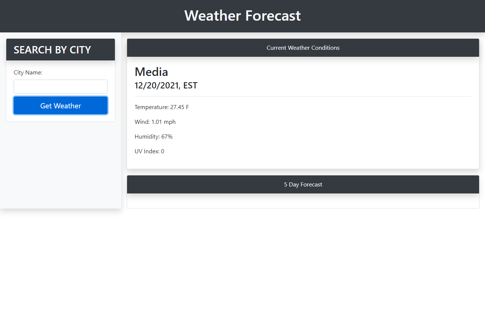

# weather-forecaster

- Weather forecasting app to search conditions based on location. 

- https://github.com/warrenhaskins1/weather-forecaster
- https://warrenhaskins1.github.io/weather-forecaster/

## Description

- The goal was to build a Weather Forecasting Dashboard. 
- The user can search by city name which will return the current forecast as well as a 5 day forecast.
- The user's previous searched cities will be available at a button click.

## Installation
The only required equipment neccessary to play are a web-browser and internet connection.

    
## Credits
- https://stackoverflow.com/
- https://www.w3schools.com/
- https://developer.mozilla.org/en-US/
- https://gomakethings.com/how-to-use-the-fetch-method-to-make-multiple-api-calls-with-vanilla-javascript/
- https://coderrocketfuel.com/article/convert-a-unix-timestamp-to-a-date-in-vanilla-javascript
- https://www.youtube.com/watch?v=FN_ffvw_ksE
